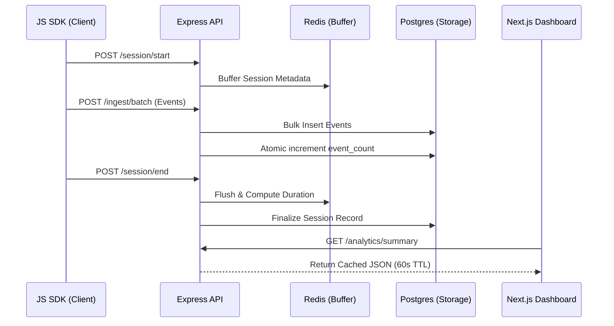

# UXClone - Open Source Session Replay & Analytics

UXClone is a powerful, self-hosted session replay and user analytics platform inspired by UXCam. It allows developers to capture user interactions, visualize sessions through an event-based replay engine, and gain deep insights into user behavior.

## 🚀 Features

- **Session Replay**: Visualize user journeys with a custom event-marker replay engine.
- **Event Tracking**: Capture clicks, scrolls, navigation, and custom events with zero-dependency SDK.
- **Analytics Dashboard**: Real-time summary of active users, session duration, and top screens.
- **Multi-Tenant Ready**: Project-based isolation for managing multiple applications.
- **Privacy First**: Built-in PII masks ensure sensitive user data never leaves the client.
- **Performance Optimized**: Materialized views and Redis caching for sub-second dashboard queries.

## 🛠 Tech Stack

- **Frontend**: Next.js 16.2.1 (App Router), Tailwind CSS, Lucide Icons
- **Backend**: Express.js, TypeScript
- **Database**: PostgreSQL 16 (Primary Store)
- **Cache**: Redis 7 (Rate Limiting & Session Buffering)
- **Deployment**: Docker & Docker Compose

## 🏃 Quick Start

The fastest way to get UXClone running is using Docker Compose.

### 1. Clone the repository
```bash
git clone <repository-url>
cd UxCam-Clone
```

### 2. Setup environment variables
```bash
cp .env.example .env
```

### 3. Start the platform
```bash
# This starts Postgres, Redis, the API, and the Dashboard
docker-compose up -d --build
```

### 4. Access the services
- **Dashboard**: [http://localhost:3000](http://localhost:3000)
- **API Server**: [http://localhost:3001](http://localhost:3001)

---

## 💻 Development

### Running Migrations
If you make changes to the database schema, run the migrations from the root:
```bash
docker exec -it uxclone-api npm run migrate
```

### Test Harness
To generate synthetic data for testing:
1. Open `sdk/dev/test-harness.html` in your browser.
2. Click "Start Session" and interact with the page.
3. Refresh the Dashboard to see your session appear.

## 🏗 Architecture



## 📂 Project Structure

- `frontend/`: Next.js dashboard and replay viewer.
- `backend/`: Express API server and database services.
- `sdk/`: Vanilla TypeScript library for client-side recording.
- `docker-compose.yml`: Infrastructure orchestration.

## 📄 License

This project is licensed under the MIT License - see the [LICENSE](LICENSE) file for details.
